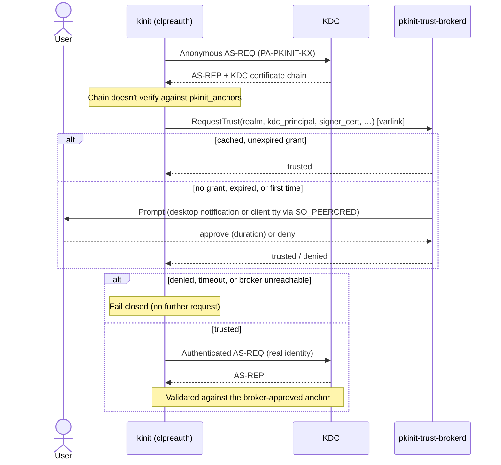

# kurbu5-pkinit

A Rust reimplementation of the MIT Kerberos PKINIT pre-authentication
mechanism (RFC 4556), built as a loadable MIT krb5 preauth plugin.

## Overview

The workspace is split into several crates:

- **`pkinit-core`** — a pure Rust library with no dependency on MIT krb5.
  It implements the PKINIT protocol state machines (client and KDC side),
  X.509/CMS handling, key derivation, and certificate-based authorization
  checks.
- **`kurbu5-pkinit`** — a thin `cdylib` adapter that bridges `pkinit-core`
  to MIT Kerberos via the [`kurbu5-rs`](https://crates.io/crates/kurbu5-rs)
  plugin bindings. It builds a single shared object exporting the
  `clpreauth`, `kdcpreauth`, and `certauth` plugin entry points.
- **`pkinit-trust-proto`** — the [varlink](https://varlink.org/) interface
  shared by the plugin and the trust broker (see
  [TOFU](#kdc-ca-trust-on-first-use-tofu) below).
- **`pkinit-trust-brokerd`** — a reference trust broker daemon: the varlink
  service that owns TOFU policy and prompts the user.
- **`pkinit-trust-ctl`** — a separate client for the broker that lists or
  exports its current trust store as permanent `pkinit_anchors`
  configuration.

ASN.1 encoding/decoding, X.509 parsing, and certificate chain validation are
provided by the [`synta`](https://crates.io/crates/synta) family of crates;
DH/ECDH key agreement and KDF primitives are provided by
[`native-ossl`](https://crates.io/crates/native-ossl).

## Features

- Core PKINIT with DH and elliptic-curve key exchange, for both `kinit`
  (client) and the KDC
- Anonymous PKINIT (PA-PKINIT-KX)
- Algorithm-agile key derivation, with fallback to the legacy
  `octetstring2key` derivation for peers that don't negotiate a KDF
- Post-quantum key exchange via ML-KEM-512/768/1024, with ML-DSA-based
  downgrade prevention
- Freshness token support to mitigate AS-REQ replay
- Certificate-based client authorization: SAN, UPN, and EKU checks, CRL
  checking, and configurable minimum DH/EC group strength
- Identity loading from PEM/DER files, PKCS#12 bundles, or a PKCS#11
  hardware token URI
- Interop-tested against the stock MIT `pkinit.so` in both client and KDC
  roles (see [Testing](#testing))

## Supported RFCs and Internet-Drafts

### RFCs

| RFC | Role |
|---|---|
| [RFC 3526](https://www.rfc-editor.org/rfc/rfc3526) | More MODP Diffie-Hellman groups — Oakley 2048-bit and 4096-bit groups |
| [RFC 4556](https://www.rfc-editor.org/rfc/rfc4556) | PKINIT — core protocol: PA-PK-AS-REQ/REP, DH/EC key exchange, legacy key derivation |
| [RFC 5280](https://www.rfc-editor.org/rfc/rfc5280) | X.509 PKI certificate and CRL profile — chain/path validation |
| [RFC 5652](https://www.rfc-editor.org/rfc/rfc5652) | Cryptographic Message Syntax — SignedData for AuthPack/KDCDHKeyInfo, including the unsigned variant used for anonymous PKINIT |
| [RFC 6112](https://www.rfc-editor.org/rfc/rfc6112) | Anonymous PKINIT — PA-PKINIT-KX |
| [RFC 8062](https://www.rfc-editor.org/rfc/rfc8062) | Anonymous Kerberos — `WELLKNOWN/ANONYMOUS` principal handling |
| [RFC 8070](https://www.rfc-editor.org/rfc/rfc8070) | Kerberos Pre-Authentication Freshness — PA-AS-FRESHNESS |
| [RFC 8636](https://www.rfc-editor.org/rfc/rfc8636) | PKINIT Algorithm Agility — SP800-56A KDF and its negotiation |
| [RFC 9935](https://www.rfc-editor.org/rfc/rfc9935) | AlgorithmIdentifier encodings for ML-KEM/ML-DSA, used for the PQC OIDs |

### Internet-Drafts

| Draft | Role |
|---|---|
| [draft-bokovoy-kitten-pkinit-pqc](https://datatracker.ietf.org/doc/draft-bokovoy-kitten-pkinit-pqc/) | Post-quantum PKINIT key exchange via ML-KEM, with ML-DSA-based downgrade prevention |

### Other standards

| Standard | Role |
|---|---|
| FIPS 203 (ML-KEM) | Post-quantum key encapsulation mechanism (512/768/1024) |
| FIPS 204 (ML-DSA) | Post-quantum signatures, used for downgrade-prevention checks on KDC certificates |
| NIST SP 800-56A | Single-step concatenation KDF underlying RFC 8636 |

## Building

Prerequisites:

- A Rust toolchain with 2024 edition support (1.85+)
- MIT Kerberos development headers (`krb5-devel` / `libkrb5-dev`), 1.21+
- `libclang` (used by `bindgen` to generate the krb5 FFI bindings)
- OpenSSL development headers

```sh
cargo build --release
```

This produces `target/release/libkurbu5_pkinit.so`.

## Installing

Copy (or symlink) the built shared object into your krb5 plugin directory,
typically as `pkinit.so`:

```sh
install -m 755 target/release/libkurbu5_pkinit.so \
    /usr/lib64/krb5/plugins/preauth/pkinit.so
```

The plugin registers itself for both client (`kinit`) and KDC use; no
separate client/KDC builds are needed.

## Configuration

Configuration is read from `krb5.conf` using the standard `pkinit_*` options
under `[libdefaults]` / `[realms]` (client) and `[kdcdefaults]` / `[realms]`
(KDC):

| Option | Applies to | Purpose |
|---|---|---|
| `pkinit_identities` / `pkinit_identity` | client / KDC | Identity source (file, dir, PKCS#12, or PKCS#11 URI). A password-protected PKCS#12 file is never given a password in this setting — the client asks for one via the krb5 responder interface (question key `pkinit_pkcs12_password`); callers that don't register a responder (e.g. plain `kinit`) will get a clear failure instead of a silent empty-password attempt. |
| `pkinit_anchors` | both | Trusted CA certificates |
| `pkinit_pool` | both | Intermediate certificates |
| `pkinit_revoke` | both | CRLs |
| `pkinit_require_crl_checking` | both | Reject if no CRL is available for an anchor |
| `pkinit_dh_min_bits` | both | Minimum acceptable DH/EC group strength |
| `pkinit_eku_checking` | both | `kpClientAuth`, `scLogin`, or `none` |
| `pkinit_require_freshness_token` | both | Require an RFC 8070 freshness token |
| `pkinit_pqc_min_algorithm` | both | Minimum ML-KEM strength to offer/accept |
| `pkinit_allow_upn` | KDC | Accept Microsoft UPN SANs for client authorization |
| `pkinit_indicator` | KDC | Authentication indicators to attach on successful PKINIT |
| `pkinit_kdc_trust_tofu` | client | Enable trust-on-first-use of the KDC CA (default `false`) |
| `pkinit_kdc_trust_broker` | client | Trust-broker socket path (default `$XDG_RUNTIME_DIR/pkinit-kdc-trust.sock`) |
| `pkinit_kdc_trust_timeout` | client | Seconds to wait for a broker reply (default `30`) |

### KDC CA trust-on-first-use (TOFU)

When `pkinit_kdc_trust_tofu = true` and the KDC's certificate does not chain to
any configured `pkinit_anchors`, the client asks an external trust broker over a
[varlink](https://varlink.org/) Unix socket whether to trust the CA the KDC
presented. New trust is only ever established during the **anonymous** exchange
(so the client identity is never sent to a not-yet-trusted KDC); this requires
`auto_fast_armor = true` (or a prior `kinit -n`) so the anonymous exchange runs
first. The daemon owns policy and remembers decisions; the authenticated
exchange only validates against an already-approved CA and fails if none exists.
The broker's approval selects which anchors to trust — the certificate chain,
KDC EKU, and KDC SAN are still verified cryptographically. Everything fails
closed: no broker, a timeout, or a denial aborts the exchange.



A reference broker daemon (`pkinit-trust-brokerd`) that remembers per-realm
pins ships in this workspace; the varlink interface it speaks is defined in
`pkinit-trust-proto`. Each approval is time-boxed: the user picks how long to
trust the CA (15 minutes, 1 hour, 1 day, 1 week, or forever); once a grant
lapses, the broker forgets it and treats the realm as unknown again rather
than either trusting or denying it outright.

By default (`--ui auto`) the daemon prompts via a desktop notification
(`org.freedesktop.Notifications`) with a button for each grant duration plus
Deny, when a graphical session is detected (`$DISPLAY`/`$WAYLAND_DISPLAY`);
otherwise, or if the notification daemon can't render actions, it falls back
to prompting on the *connecting client's* controlling terminal — found via
the client's PID from `SO_PEERCRED` on the socket, not the broker's own tty
(the broker may not have one at all; see autoactivation below). This is what
makes TOFU consent work for a plain-console `kinit`, a root shell, or an SSH
session with no graphical session anywhere in the picture. `--ui gui` and
`--ui tty` force one or the other, and `--auto approve|deny` remains for
non-interactive CI/testing use. If neither a notification nor a client
terminal is usable, the request is denied rather than left unanswered. See
the module docs at the top of `pkinit-trust-brokerd/src/main.rs` for the
full flag reference.

Since the prompt appears directly on the client's own terminal (not the
broker's), a user running `kinit` against an unknown realm sees this — no
separate broker window or log to go check:

```
$ kinit user@DEMO.EXAMPLE.COM
PKINIT: KDC realm DEMO.EXAMPLE.COM (principal krbtgt/DEMO.EXAMPLE.COM@DEMO.EXAMPLE.COM) presents an unrecognized CA:
  Subject:    CN=Test KDC CA
  SHA-256:    9c278c2ade5694d542c6f4c15c682f88866016db240f95685bfe2889038b2d4c
Trust this CA for DEMO.EXAMPLE.COM?
  1) 15 minutes
  2) 1 hour
  3) 1 day
  4) 1 week
  5) forever
  N) No, deny
Choice: 2
Password for user@DEMO.EXAMPLE.COM:
```

The daemon supports systemd socket activation (`sd_listen_fds(3)`), so it
doesn't need to be started ahead of time: `contrib/systemd/` ships a
reference `.socket`/`.service` pair for a per-user instance.
`cmake --install` (see [Installing](#installing)) places both units,
with `ExecStart` already pointing at the installed binary, under
`lib/systemd/user/`. Enable the socket:

```sh
systemctl --user daemon-reload
systemctl --user enable --now pkinit-trust-brokerd.socket
```

Installing from a non-standard prefix, or without CMake, requires copying
the units manually and adjusting `ExecStart` to wherever
`pkinit-trust-brokerd` actually lives:

```sh
cp contrib/systemd/pkinit-trust-brokerd.{socket,service} ~/.config/systemd/user/
```

The first connection (i.e. the first anonymous PKINIT exchange with an
unknown KDC) starts the service on demand. The default `--ui auto` works
fine even though the service itself has no controlling terminal, since the
tty fallback prompts on the *client's* terminal rather than the broker's.

### Promoting a TOFU decision to permanent trust

The broker's pins are soft state: a time-boxed grant expires, and even a
"forever" pin only lives as long as the broker's `--state` file. `pkinit-trust-ctl`
is a separate client (ships in this workspace, alongside the daemon and
plugin) that queries the broker's trust store over the same varlink socket
and turns it into ordinary `pkinit_anchors` configuration, so a realm the
user has already confirmed no longer depends on the broker at all:

```sh
$ pkinit-trust-ctl list
REALM                          FINGERPRINT (SHA-256)                                            EXPIRES
DEMO.EXAMPLE.COM               4cc0714e28e1b114cb8117f6fce04cbb167fc73a7c8b23929c3718779b6ce8c9 never

$ pkinit-trust-ctl export --anchors-dir /etc/pki/pkinit/anchors
wrote /etc/pki/pkinit/anchors/DEMO.EXAMPLE.COM.pem
[realms]
 DEMO.EXAMPLE.COM = {
  pkinit_anchors = FILE:/etc/pki/pkinit/anchors/DEMO.EXAMPLE.COM.pem
 }
```

`export` writes one PEM file per currently-trusted realm and prints the
matching `[realms]` snippet (or writes it to `--conf-snippet FILE` instead of
stdout); nothing is ever written into an existing `krb5.conf` directly — paste
the snippet in by hand, or point `--conf-snippet` at a file pulled in via
`krb5.conf`'s `includedir`. Expired grants are never included, so a lapsed
TOFU decision can't accidentally become a permanent one.

## Testing

```sh
cargo test --workspace
```

runs the unit and protocol-level integration tests in `pkinit-core`. A full
system test that spins up an ephemeral KDC and exercises `kinit` against
this plugin (including cross-testing against the MIT `pkinit.so`) lives in
`tests/system/pkinit/run.sh`.

## License

Licensed under the MIT license — see [LICENSE](LICENSE).
